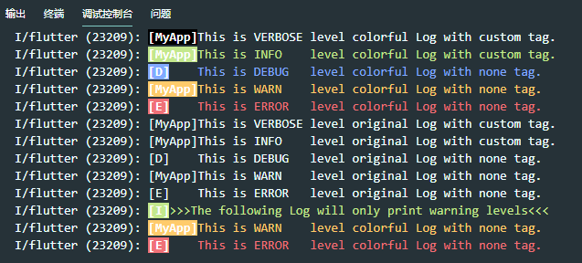

# ColorfulLog

一款彩色的Log日志输出工具。



## [English](./README-en.md) | 中文

## 开始

### 1. 添加依赖

打开`pubspec.yaml`

```yaml
# 远程依赖方式
dependencies:
  colorful_log: ^0.0.1

# 本地依赖方式
dependencies:
  colorful_log:
    path: PathOfProject

# git方式
dependencies:
  colorful_log:
    git:
      url: git://github.com/EngrZhou/ColorfulLog.git
```

### 2. 使用

```dart
///是否使用彩色log样式 true:使用 false:不使用
Log.setColorful(false);
///设置log输出级别
Log.setLogLevel(Log.warn);
```

```dart
///as android usual style
Log.V(tag, 'This is VERBOSE level colorful Log with custom tag.');

///as dart
Log.i(tag: tag, msg: 'This is INFO    level colorful Log with custom tag.');

///as dart
Log.d(msg: 'This is DEBUG   level colorful Log with none tag.');
```

## LICENSE

[The 3-Clause BSD License](./LICENSE)

